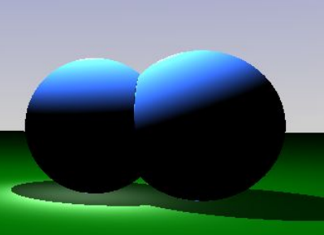
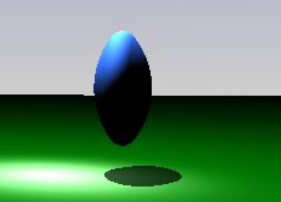
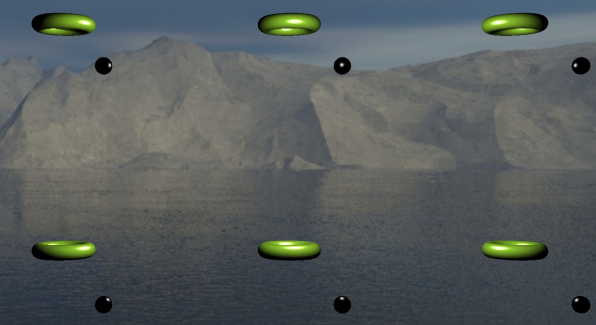

> Real-time graphics programming
> Bassi Francesca 921900

In this project I have created a few fragment shaders with an implementation of the Ray Marching
technique and a few other techniques tied with it

# Theory of Ray Marching
With the Ray Marching technique only fragment shaders are involved; with this
technique, every single pixel is processed by tracing rays to each pixel on screen
to identify shapes and objects. Objects are called primitive which are positioned
in the scene space, and are implicitly identified

## The Ray and the Pixels

Firstly iI define the starting position of the ray, which can be different from the
origin of the world [0,0,0]. Then I set the direction to follow, which is given by
the pixel on screen that are obtained by normalizing the screen coordinates.

```glsl
vec2 uv = gl_FragCoord.xy/resolution.xy;
uv -= 0.5;
uv.x *= resolution.x/resolution.y;
```
The function `gl_FragCoord` gives the pixel coordinates inside the window, then they are normalized
by dividing for the resolution of the window. As of now the coordinates are between 0.0 and 1.0. 

I then subtract 0.5 from the coordinates to set the center of the coordinate system in (0.5, 0.5)
instead of (1.0, 1.0).
Lastly, to obtain the correct pixel dimension we have to multiply the X coordinate with the ratio of
the window. Since (0.5, 0.5) is the center of a (0, 0) (1, 1) screen, to find the center of a 800x600
window I have to multiply the X coordinate by 800/600, the ratio of the window, to find the center in
the new resolution.


### Implementation
```glsl
float RayMarch(vec3 ray_origin, vec3 ray_direction)
{
    float travel = 0.0;
    float obj = 0.0;
    for (int i=0; i<MAX_STEP; i++)
    {
        vec3 point = ray_origin + ray_direction * travel;
        obj = GetDist(point);
        travel += obj;
        if (travel > MAX_DIST || obj < PRECISION) break;
    }
    return travel;
}
```
The Ray Marching technique works in a very simple way:

* the inputs of the function are the position and direction of the ray;
*  the variables travel and obj are initialized
    * travel: it is the effective distance the ray has traveled
    * obj: minimum distance from the point of arrival of the ray and the closest object in
the scene
* in a for loop I determine where the end of the ray is, and from that point, with the function
GetDist(...), I get the minimum distance between the end point and the scene and add it to
travel.
* at the end of the loop I check the state of the ray to decide if another iteration is needed:
    * if either travel exceeds the limit of distance, meaning that the ray hasn’t
encountered any obstacle on its path, OR the end of the ray is close enough to an
object in the scene, exit from the loop

In the end, the travel value is returned.


# Boundaries, primitives, and operations 

## Boundaries:

### PRECISION: An higher value mean a very high imprecision of the shape. A small value means more
precision, but it requires an higher computational effort

|  precision = 0.5 | precision = 0.01   |
|:-:|:-:|
|   |   |


MAX_STEP: A small value means imprecision, indeed there is an obvious deformation around the
shape. An higher value increase the precision, but the ray has to march further and it may need an higher computational effort.
|  max step = 100 | max step = 400   |
|:-:|:-:|
|   |   |


MAX_DIST: A lower value prevents the ray to see distant objects. An higher value allows a better
rendering of far away objects , however it also means an higher number of points to be rendered
which requires an higher computational effort.
|  max dist = 10 | max step = 400   |
|:-:|:-:|
|   |   |


## Primitives
The primitives are simple geometric shapes.
The implemented primitives are sphere, cube and torus.

### Plane:
The minimum distance from a plane is detected by the Y component of the ray.
 
```glsl
Hit df_plane (vec3 rayPos)
    return 2+rayPos.y;
``` 

### Sphere:
The minimum distance to represent a sphere is calculated by getting the distance between the
endpoint of the ray (blue point) and the center of the sphere, and subtracting the radius to it.
 
```glsl
float df_Sphere(vec3 rayPos, vec3 spherePos, float size)
    return length(rayPos - spherePos) - size;
```
### Cube:
For a cube we have the values of height, width and depth. in this case assume to have a cube with
equal edges.
The distance between the ray and the cube:
1) Calculate the distance d as the absolute value of position - size (equal to: position.xyz -
size.xyz)
2) The minimum distance to the cube is the length of d, → `length(max(abs-size,0.0))`

 
```glsl
float df_Box(vec3 rayPos, vec3 pos, float s )
{
    pos = rayPos - pos;
    vec3 size = vec3(s);
    vec3 d = abs(pos) - size;
    float dist = length(max(d,0.0));
    return dist;
}
```
### Torus:
Firstly we calculate the vector between the center of the shape and the position of the ray called
pos. Then we create a new vec2, where in the X component we store the length of pos.xz minus the
biggest radius, and as a Y component we store the Y component of pos vector. Inthe end the length
of the newest vec2 minus the smaller radius is the minimum distance.

 
```glsl
Hit df_Torus( vec3 rayPos, vec3 pos, float rad)
{
pos = rayPos - pos;
vec2 radius = vec2(rad, rad*0.3);
vec2 q = vec2(length(pos.xz)-radius.x,pos.y);
float dist = length(q)-radius.y;
return dist;
}
```
## Operators
### Union
 
```glsl
float opUnion( float d1, float d2 )
{ min(d1,d2); }
```
## Subtraction
 
```glsl
float opSubtraction( float d1, float d2 )
{ return max(-d1,d2); }
```
|d1 = A e d2 = B |   |
|:-:|:--|
|| In the first step, the ray is outside A and B, so the greater distance between -A and B is B |
|| Next step: the ray is inside A and outside B, which means the negative value of the distance A becomes positive. Then the bigger value between the nearest distance B and the -A is -A.  |
||In the last step the ray is inside A and B, the greater distance between -A and B is B and the minimum precision is reached.   |


### Intersection
 
```glsl
float opIntersection( float d1, float d2 )
{ return max(d1,d2); }
```

|d1 = A e d2 = B |   |
|:-:|:--|
||In the first step, where the ray is outside A and outside B, the greater distance between A and B is B|
||Next step: the result distance has reached the PRECISION value and the marching is stopped.|

The results are:
- With a ray outside A AND B, the greater distance is the furthest shape
- With a ray inside A OR B, the greater distance is the outside shape.

### Smooth
Smooth operators are the same operators but with a polynomial interpolation

|Smooth Union|Smooth Subtraction|Smooth Intersection|
|:-:|:-:|:-:|
||||

```glsl
float opSmoothUnion( float d1, float d2, float k )
{
    float h = clamp( 0.5 + 0.5*(d2-d1)/k, 0.0, 1.0 );
    return mix( d2, d1, h ) - k*h*(1.0-h); 
}
```
```glsl
float opSmoothSub( float d1, float d2, float k ) 
{
    float h = clamp( 0.5 - 0.5*(d2+d1)/k, 0.0, 1.0 );
    return mix( d2, -d1, h ) + k*h*(1.0-h); 
}
```
```glsl
float opSmoothIntersection( float d1, float d2, float k ) 
{
    float h = clamp( 0.5 - 0.5*(d2-d1)/k, 0.0, 1.0 );
    return mix( d2, d1, h ) + k*h*(1.0-h); 
}
```
### Repetition
It is an operation where the position of the ray is altered with the
mod operator. K is the value of repetition: with a good K, we have
to consider that K to be greater than the doubled size of the
object.

```glsl
float k = 10.0;
rayPos.yx = mod((rayPos.yx),k);
rayPos -=vec3(k * 0.5);
```


# Rendering
## BN


The color is given by the distance of the object from the ray origin.

`fragColor = travel`

## Blinn-phong


The Blinn-Phong technique is composed by 2 fundamental
elements.
* **Diffusive component**: The diffusive component is how the
light hits the object. We define the value as a dot product
between the light vector and the normal vector of the
surface point.
* **Specular component**: The specular component is obtained
with this formula where α=10: <br>
`spectular = reflected · light`<sup>`α`</sup> <br>
`Alpha` determine the size of the reflection. The reflected
vector is given by the function `reflect (-light, normal)`, where
`-light` is the incidence of the light and `normal` is the normal of
the surface.

`fragColor = diffusive * color + specular * color`

## Stripes


Like the Blinn-Phong technique but the color is altered using
the function `RampCoeff`, with the **diffusive value** (the result
of the dot product) and **number of stripes** as inputs.
This function returns a float defined by the function mix,
which takes as input:` 0.1, 1.0 `(that are the color
contribution), and the `linear interpolation` defined by
t1/stripes, where t1 is the multiplication between the
diffusive value and the number of stripes, all mod number
of stripes.

`fragColor = RampCoeff(diffusive, 4)*color+RampCoeff(specular,4)*color`

## Reflection

Given a **surface point**, the **position of the camera**, the
**normal** and a **cube map**, to obtain the reflection over the
surface we use the vector V, the vector between the
surface point and the camera position. 
I get the reflection with the function reflect using vector V and normal vector.
Then with the texture function with the cube map and the reflection I obtain the final color for the surface.

`fragColor = texture(cubeMap, reflect)`

## Fresnel
|   |   |
|---|---|
| ||

We have to calculate some values, like reflected and refracted
values.
For the **reflection** value we can use the same value generated
with the previous technique, so we need the vector V and the
function reflect with the normal and the V as incident vector,
then the texture with the cube map and the vector returned
by the function.

To calculate the **refraction** we need to calculate the vector L ,
the distance between the light and the surface, and H, which is
the sum of the vectors V and L (average between two vectors).
Using the refraction function, with vector V, the normal of the
surface and the parameter Eta as input, the function will
return a vector, that will be used for the function texture with
the cube map.
The final color is given by the mix between the reflected and
the refracted color, mixed with the ratio given by the formula:

`ratio = F0 + (1.0 − F0) * (1.0 − max(dot(V , H), 0)`<sup>`5`</sup>

where `F0 = (1.0+Eta)*(1.0+Eta) / (1.0−Eta)*(1.0−Eta)`

`fragColor = refracteColor, reflectedColor, ratio)`
___ 
Other techniques
## Dithering


This techniques allows some pixel to be colored* based on a noise
texture*. Where the texture is white, the pixel will be black and where
the pixel is black, the pixel will be colored.
Given a noise texture and an uv coordinate, with the texture function
we set a variable limit that stores the color at coordinate uv of the
texture. If the limit is greater than the color of the image (1.0 is
white, 0.0 is black), the result is black, if the color is greater than the
limit, the pixel will have color provision 1.0 (colored).
```glsl
float limit = texture (noise, uv/resolution).b
float result = bright < limit ? 0.0 : 1.0
```
`finalColor =* result`

## Second-pass


This is a second pass of rendering, indeed the first
color computed is summed with a second color
computed. The first rendering pass gives the first color,
the second pass is calculated with a raymarching
where ray origin is surface point and the ray direction
is the reflection of the original ray direction and
normal. If the raymarching finds a new surface, the
color will be computed with blinn-phong techniques.
This color will be summed to the first color.

## Selection


This feature allows the user to see which
shape is selected in the scene with a white
border.
To do this only the dot product of the
vector between the camera position and
the surface position, and the normal of
the surface are needed. If the dot product
is between -0.3 and 0.3, the pixel will be
white because it is the border of the
shape.
For an higher precision when two shapes
are close, while the distance with ray
marching to the shape is calculated: if the
point is close (distance < 0.3) to the
selected shape , the point will be marked
as selected,

## Shadow
The shadows are generated at runtime, during the rendering phase. For each point identified with
the Raymarch function, the point is used as origin for another call to the Raymarch function with the
vector between the new origin and the light source as ray direction. If the result of the function
Raymarch is less than the distance of the vector between the new origin and the light, there is
something in the middle, the light is obstructed and the contribution of the color is lowered.


# Performance
There are 2 different alternatives of the developed application:
* MULTI: there are different fragment shaders, each in its own file `.frag`
* ORIGINAL: there is only one fragment shader with many if construct to distinguish each
rendering methods.

The data of the Frames Per Seconds were obtained using the two different applications, with the
same amount and type of object in the scene, with the same movement, and position.

### Hardware Specification:
* CPU: Intel Core i7-9750H
* GPU: NVIDIA GeForce RTX 2060 (Laptop)
* RAM: 16384 MB

## Results 
|Multi | BN| Blinn-Phong | Stripes | Reflect | Fresnel |
|---|:-:|:-:|:-:|:-:|:-:|
|800x600 | 144 |75| 62| 90| 97|
|Plane |39| 20| 14| 20| 24|
|SecondPass| 142| 66| 57| 82| 83|
|1920x1080 |50| 26| 20| 30| 30|
|Plane| 11 |6 |4 |6| 6|
|SecondPass| 47| 24| 19| 27| 28|


|Original| BN| Blinn-Phong| Stripes| Reflect| Fresnel|
|---|:-:|:-:|:-:|:-:|:-:|
|800x600| 68| 65| 64| 62| 64|
|Plane| 16| 14| 14| 14| 16|
|SecondPass| 68| 58| 57| 58| 60
|1920x1080| 20.5| 20| 19.8| 19.7| 20|
|Plane| 4.4| 3.8| 3.8| 3.8| 4.0|
|SecondPass| 20.5| 18.7| 18.7| 18.5| 19|

The difference between the two solutions is clear. 
I presume that the compiler sees the different
flows created by the many if statement and tries to optimize them. In fact the values of the
ORIGINAL are quite similar independently of the technique used.

In the MULTI application, the frame rate seems higher, however from one technique to another the
rate swings heavily
Frame rate drop for the plane: it happens while rendering the plane. By using an higher value for
MAX_DIST, the plane will extend more, therefore increasing the surface to be rendered.

# Implementation choices
The application is parameterized, allowing the user to interact with the moving figures like change shape, operator, color…
## Data structure
```glsl
struct Blob
{
    float shape;//sphere, cube, torus
    vec3 position;
    vec3 color;
    float size;
    float selected;
    float operator; //union, subtraction, intersection
    float morph;
};
```
This data structure contains all the informations of a single object in the scene
```glsl
struct Hit
{
    float dist;
    bool subject;
    float selected;
};
```
This data structure is the result of the virtual “collision” between the ray and an object in the scene.
It stores the minimum distance and information about the object, like if it is selected or is a subject
(an object different from a plane). These are information obtained from the Blob data structure.

# GUI
## Main GUI


The user can interact with the scene with
this general window that has some options:
Models e Raymarching:
* Models: A scene where the shader is
applied over a model (a real one, with
vertices) with fresnel with Eta = 1.010
* Raymarching: A scene generated
with the ray marching technique.
* Blinn-Phong, Stripe, Reflect, Fresnel,
Bubble, BN are the different rendering
techniques used to render each points. The
user can switch between the techniques
with these buttons.
Checkbox are parameters used in scene
- Plane: add a plane
- Second Pass: a second pass of render is used
- Repetition: the operator repetition is used
- Dithering: this will change the techniques to dithering
- Background Texture: allow the user to change the cube map of the scene
- Create object: add a new object with some randomized parameters. The limit in the scene is
for 10 objects.
- Checkbox Move Camera: the camera starts moving based on a fixed function. The movement
is managed by the fragment shader; as a matter of fact it is simulated by changing the origin
of the ray.

## Object GUI


Each object in the scene has an “object GUI”where the
user is allowed to change shape, color, operator, position,
scale and movement.
Checkbox:
- Morph: the object starts morphing back and forth
from the original shape to the next in the list.
- Select: allows the user to select the object by
showing an outer line on it.
- Moving: the object starts moving and the user can
modify the movement.
The Reset button reset the position to the origin of the
world, then the Random button set the position of the
object to a randomized position in the scene.

# Library used
* Window renderer: [GLFW - v3.3](https://www.glfw.org/)
* Implement of OpenGL specification: [GLAD](https://glad.dav1d.de/)
* GUI: [ImGui - v1.60](https://github.com/ocornut/imgui/releases)
* Math: [glm - v2.15](https://glm.g-truc.net/0.9.9/index.html)
* Texture loading: [std_image - v4.2](https://github.com/nothings/stb)
* Models/assets loading: [assimp - v4.0.1](http://www.assimp.org/)
* Tutorial distance functions: [The Art Of Code](https://www.youtube.com/channel/UCcAlTqd9zID6aNX3TzwxJXg)
* Tutorial Shading: [xdPixel](http://xdpixel.com/)
* Tutorial OpenGL: [LearnOpenGL](https://learnopengl.com/)
